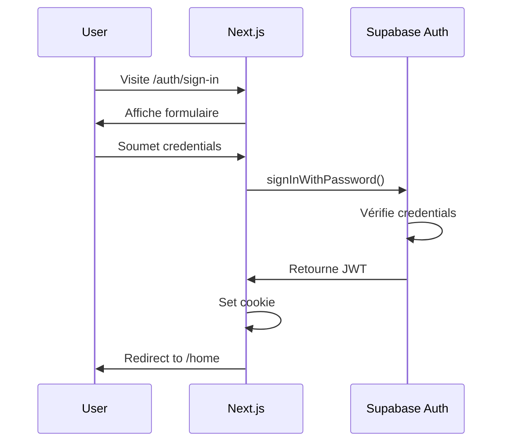
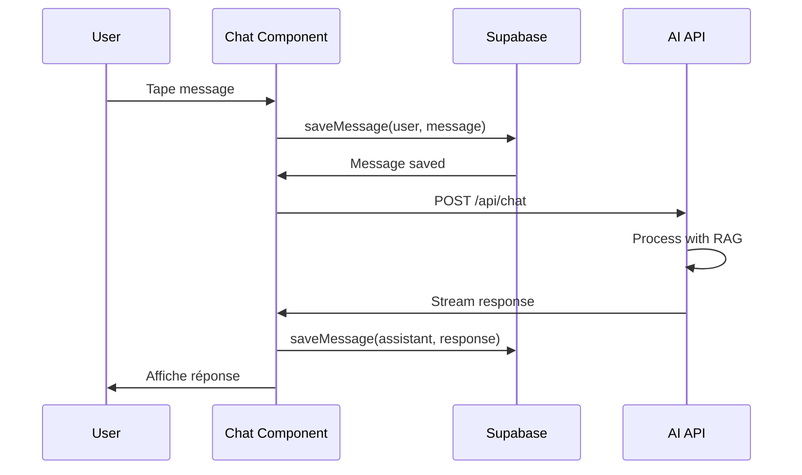
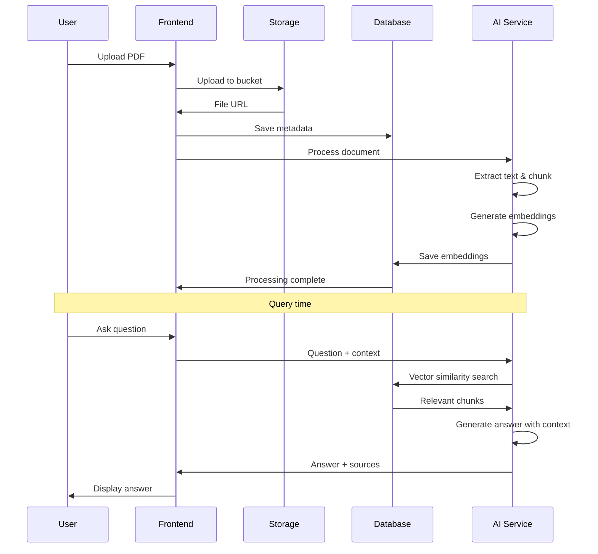

# Vue d'ensemble de l'architecture

SharingBot V3 est construit sur une architecture moderne et modulaire utilisant un monorepo Turborepo.

## Architecture globale

```
┌─────────────────────────────────────────────────────────┐
│                     Client Browser                       │
│  ┌─────────────────────────────────────────────────┐   │
│  │           Next.js 15 App Router                  │   │
│  │  ┌──────────┐  ┌──────────┐  ┌──────────┐     │   │
│  │  │Marketing │  │   Auth   │  │   Home   │     │   │
│  │  │  Pages   │  │  Pages   │  │  (Chat)  │     │   │
│  │  └──────────┘  └──────────┘  └──────────┘     │   │
│  └─────────────────────────────────────────────────┘   │
└────────────────────┬────────────────────────────────────┘
                     │ HTTPS/WebSocket
┌────────────────────┴────────────────────────────────────┐
│                   Supabase Backend                       │
│  ┌─────────┐  ┌─────────┐  ┌─────────┐  ┌─────────┐  │
│  │  Auth   │  │Database │  │ Storage │  │Realtime │  │
│  │PostgreSQL│  │PostgREST│  │  S3-like│  │WebSocket│  │
│  └─────────┘  └─────────┘  └─────────┘  └─────────┘  │
└──────────────────────────────────────────────────────────┘
                     │
┌────────────────────┴────────────────────────────────────┐
│               External Services                          │
│  ┌─────────────┐  ┌──────────────┐  ┌──────────────┐  │
│  │Hugging Face │  │Google Vision │  │  Other APIs  │  │
│  │     AI      │  │     OCR      │  │              │  │
│  └─────────────┘  └──────────────┘  └──────────────┘  │
└──────────────────────────────────────────────────────────┘
```

## Principes architecturaux

### 1. Monorepo avec Turborepo

Le projet utilise Turborepo pour gérer un monorepo efficace:

- **Builds incrémentaux**: Seuls les packages modifiés sont reconstruits
- **Cache distribué**: Partage des builds entre développeurs
- **Dépendances internes**: Gestion automatique des dépendances entre packages
- **Exécution parallèle**: Les tâches indépendantes s'exécutent en parallèle

### 2. Séparation des préoccupations

```
apps/          → Applications complètes
packages/      → Packages réutilisables
tooling/       → Configuration partagée
```

Chaque package a une responsabilité unique et bien définie.

### 3. Type Safety

- **TypeScript strict** dans tout le codebase
- **Génération automatique** des types depuis Supabase
- **Validation runtime** avec Zod
- **Props typées** pour tous les composants React

### 4. Sécurité par défaut

- **Row Level Security (RLS)** sur toutes les tables Supabase
- **Authentification JWT** avec Supabase Auth
- **CSRF Protection** avec @edge-csrf
- **Variables d'environnement** pour les secrets

## Couches de l'application

### Layer 1: Présentation (Frontend)

**Technologie**: Next.js 15 App Router + React 19

```
apps/web/app/
├── (marketing)/        # Pages publiques
│   ├── page.tsx       # Page d'accueil
│   ├── about/         # À propos
│   └── pricing/       # Tarifs
├── auth/              # Authentification
│   ├── sign-in/       # Connexion
│   ├── sign-up/       # Inscription
│   └── callback/      # Callback OAuth
└── home/              # Application protégée
    ├── page.tsx       # Dashboard principal
    ├── _components/   # Composants du chat
    └── hooks/         # Custom hooks
```

**Responsabilités**:
- Rendu de l'interface utilisateur
- Gestion des interactions utilisateur
- Routing et navigation
- State management local

### Layer 2: Logique métier

**Emplacement**: `apps/web/app/lib/` et `packages/features/`

```
lib/
├── asr-service.ts           # Reconnaissance vocale
├── tts-service.ts           # Synthèse vocale
├── ocr-service.ts           # OCR
├── language-detector.ts     # Détection de langue
└── supabase/
    ├── conversations.ts     # CRUD conversations
    └── documents.ts         # Gestion documents
```

**Responsabilités**:
- Business logic
- Intégration avec les services externes
- Transformation des données
- Règles métier

### Layer 3: Accès aux données

**Technologie**: Supabase Client + PostgreSQL

```
packages/supabase/src/
├── browser-client.ts        # Client côté navigateur
├── server-client.ts         # Client côté serveur
├── middleware-client.ts     # Client pour middleware
└── database.types.ts        # Types générés
```

**Responsabilités**:
- Communication avec Supabase
- Queries et mutations
- Real-time subscriptions
- File storage

### Layer 4: Base de données

**Technologie**: PostgreSQL 15 + pgvector

```sql
-- Tables principales
conversations       -- Historique des conversations
messages           -- Messages individuels
documents          -- Métadonnées des documents
document_embeddings-- Vecteurs pour RAG
auth.users         -- Utilisateurs (Supabase Auth)
storage.objects    -- Fichiers stockés
```

**Responsabilités**:
- Persistance des données
- Contraintes d'intégrité
- Recherche vectorielle (RAG)
- Row Level Security

## Flux de données

### 1. Flux d'authentification



### 2. Flux de chat



### 3. Flux de RAG



## Patterns architecturaux

### 1. Server Components par défaut

Next.js 15 utilise les Server Components par défaut:

```tsx
// Server Component (par défaut)
async function HomePage() {
  const data = await fetchData(); // Direct DB access
  return <div>{data}</div>;
}

// Client Component (explicit)
'use client';
function InteractiveComponent() {
  const [state, setState] = useState();
  return <button onClick={() => setState(...)}>Click</button>;
}
```

**Avantages**:
- Moins de JavaScript côté client
- Accès direct à la DB
- SEO amélioré
- Performances optimales

### 2. React Query pour le cache

```tsx
function useConversations(userId: string) {
  return useQuery({
    queryKey: ['conversations', userId],
    queryFn: () => getConversations(userId),
    staleTime: 5 * 60 * 1000, // 5 minutes
  });
}
```

**Avantages**:
- Cache automatique
- Revalidation en arrière-plan
- Optimistic updates
- Gestion des erreurs

### 3. Custom Hooks pour la logique

```tsx
function useConversationPersistence({ conversationId }) {
  const saveMessage = async (role, content) => {
    // Logic here
  };
  
  const loadMessages = async () => {
    // Logic here
  };
  
  return { saveMessage, loadMessages };
}
```

**Avantages**:
- Réutilisabilité
- Testabilité
- Séparation UI/logique

### 4. Repository Pattern pour les données

```tsx
// conversations.ts (Repository)
export async function getConversations(userId: string) {
  const supabase = getClient();
  const { data, error } = await supabase
    .from('conversations')
    .select('*')
    .eq('user_id', userId);
  
  return data;
}
```

**Avantages**:
- Centralisation des queries
- Abstraction du client Supabase
- Facilite les tests
- Changement de DB plus facile

## Sécurité

### 1. Row Level Security (RLS)

Toutes les tables ont des policies RLS:

```sql
-- Les utilisateurs ne voient que leurs conversations
CREATE POLICY "Users can view their own conversations"
  ON conversations FOR SELECT
  USING (auth.uid() = user_id);
```

### 2. Type-safe environment variables

```tsx
import { z } from 'zod';

const envSchema = z.object({
  NEXT_PUBLIC_SUPABASE_URL: z.string().url(),
  NEXT_PUBLIC_SUPABASE_ANON_KEY: z.string().min(1),
});

export const env = envSchema.parse(process.env);
```

### 3. CSRF Protection

```tsx
import { createCsrfProtect } from '@edge-csrf/nextjs';

const csrfProtect = createCsrfProtect({
  cookie: { name: 'csrf-token' },
});
```

## Performance

### 1. Code Splitting automatique

Next.js 15 fait du code splitting automatiquement par route.

### 2. Image Optimization

```tsx
import Image from 'next/image';

<Image 
  src="/logo.png" 
  alt="Logo" 
  width={200} 
  height={100}
  priority // Pour les images above-the-fold
/>
```

### 3. Streaming avec Suspense

```tsx
import { Suspense } from 'react';

function Page() {
  return (
    <Suspense fallback={<Loading />}>
      <DataComponent />
    </Suspense>
  );
}
```

## Scalabilité

### Horizontal Scaling

- **Frontend**: Déployable sur Vercel, Cloudflare, AWS
- **Database**: Supabase scale automatiquement
- **Storage**: S3-compatible, infiniment scalable

### Caching Strategy

- **Static pages**: ISR avec revalidation
- **Dynamic pages**: Cache au niveau du composant
- **API responses**: Cache avec React Query

## Prochaines étapes

- 📂 [Structure détaillée du projet](project-structure.md)
- 🗄️ [Architecture de la base de données](database.md)
- 🏗️ [Monorepo Turborepo](monorepo.md)
